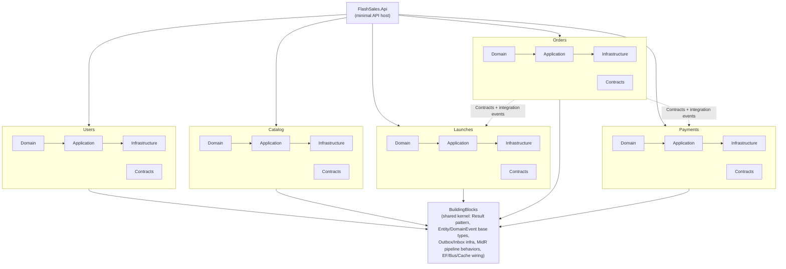
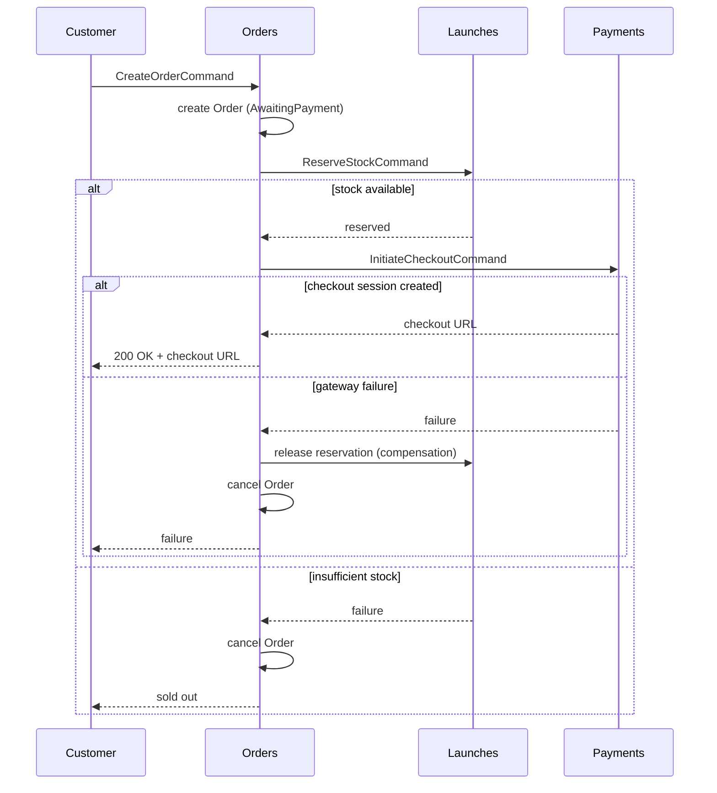

# FlashSales


A backend platform for **flash sales**: time-boxed launches with strictly limited stock, built to guarantee **zero overselling** under real concurrent load. The project is a .NET 10 modular monolith that intentionally applies the patterns a system like this actually needs in production — reliable cross-module messaging, an orchestrated saga with compensation, optimistic concurrency, and crash-recovery jobs — rather than the patterns that just look good in a diagram.

## Overview

When a launch goes live, hundreds of customers can try to buy the last few units in the same instant. The core problem this system solves is: **never sell more than exists, without serializing every request through a single lock.** That constraint shapes almost every architectural decision described below — from how stock reservation retries under optimistic concurrency, to why the order-creation saga runs synchronously instead of being fired-and-forgotten in the background.

## Architecture

FlashSales is a **modular monolith**: a single deployable process, internally partitioned into modules that behave like independent services. Each module owns its own database schema and is only allowed to depend on another module's `Contracts` project — never its `Domain` or `Infrastructure`. Cross-module effects travel as integration events (Outbox → Service Bus → Inbox), the same shape they'd take if a module were split out into its own microservice later.



Each module follows the same five-layer split:

| Layer | Responsibility |
|---|---|
| `Domain` | Aggregates, value objects, domain events, invariants — no framework dependencies |
| `Application` | Commands/queries and their handlers, orchestration logic, DTOs |
| `Infrastructure` | EF Core `DbContext`, repositories, integration event handlers, background processors |
| `Contracts` | The only thing another module is allowed to reference: public commands and integration events |
| `Endpoints` | Minimal API route registration for the module |

Requests flow through **MidR**, a lightweight custom mediator (not MediatR), with a pipeline of composable behaviors: `RequestLoggingBehavior`, `RequestValidationBehavior` (FluentValidation), `RequestTransactionBehavior` (wraps the handler in a DB transaction and flushes the Outbox in the same commit), plus `OutboxIdempotencyBehavior` / `InboxIdempotencyBehavior` for message processing. Business errors are modeled as a `Result`/`Result<T>` type, not exceptions — exceptions are reserved for genuinely unexpected failures.

## Reliability & Consistency

This is the part of the system built specifically around the "never oversell, never lose a message" requirement.

### Outbox / Inbox

Every domain event that needs to leave a module is written to that module's `OutboxMessages` table **in the same transaction** as the business change, then relayed to Azure Service Bus by a background processor (`BaseOutboxProcessor`). The receiving module writes incoming messages to its own `InboxMessages` table before processing them. This gives at-least-once delivery without ever losing an event to a crash between "save the change" and "publish the event." Idempotency is enforced with dedicated consumer-tracking tables (`OutboxMessageConsumers` / `InboxMessageConsumers`) checked by the `OutboxIdempotencyBehavior` / `InboxIdempotencyBehavior` pipeline behaviors, so a redelivered message is a safe no-op instead of a duplicate side effect.

### Order creation saga

Creating an order touches three modules in sequence: **Orders** creates the order, **Launches** reserves stock, **Payments** starts a checkout session. This is coordinated by `OrderCreationSagaOrchestrator`, run **synchronously** inside the `CreateOrderCommand` request — deliberately, so the customer gets an immediate, consistent answer ("your order is awaiting payment" or "sold out") instead of polling for a background job to catch up. If a later step fails, the orchestrator compensates the earlier ones (releasing reserved stock, cancelling the order).



### Zero overselling under concurrency

Two mechanisms work together so stock can never go negative, without a global lock serializing every purchase:

- **One active order per customer per launch**: enforced by a unique database index on `(CustomerId, LaunchId)` over active orders. Two concurrent requests from the same customer race on the same `INSERT`; only one wins.
- **Optimistic concurrency on stock**: `Launch`/`StockReservation` use PostgreSQL's `xmin` system column as a concurrency token. Reserving stock reads the current reserved quantity, checks it against the limit, and writes back — if another request wrote in between, the write fails and the handler retries against the now-current state. Two different customers competing for the last unit will both attempt the reservation, but only one `UPDATE` can win per retry cycle, and the loser's saga compensates itself (order cancelled, no stock held).

This isn't just asserted — it's covered by integration tests that fire genuinely concurrent requests (via `Task.WhenAll` against independent DI scopes) at a launch with a single unit of stock left, and assert that exactly one order ends up confirmed and reserved stock never exceeds what existed.

### Crash recovery

The synchronous saga handles the common path, but a process can still crash mid-flight. Three background sweep jobs exist specifically to reconcile the state that gets left behind:

- **`OrderExpirySweepJob`** — cancels orders that have sat in `AwaitingPayment`/`PaymentProcessing` past their expiry window.
- **`OrderSagaSweepJob`** — finds sagas stuck mid-step (e.g. stock reserved but checkout never finished) and drives them to compensation.
- **`PaymentReconciliationJob`** — re-queries the payment gateway for attempts that never received a webhook confirmation.

## Payments

Payments are abstracted behind `IPaymentGatewayService`, modeled after a Stripe-style checkout: `CreateCheckoutSessionAsync` starts a hosted checkout session, and confirmation arrives either via a signed webhook or via the reconciliation sweep above. A `Payment` aggregate tracks one or more `PaymentAttempt`s (an order can retry payment after a decline, up to a configured maximum), and webhook signature verification happens at the HTTP endpoint layer — deliberately not inside the command handler — so it can be tested as what it actually is: an HTTP-boundary concern, not a business rule.

## Tech Stack

| Category | Technology |
|---|---|
| Runtime | .NET 10, ASP.NET Core Minimal APIs |
| Database | PostgreSQL 17, EF Core (`Npgsql.EntityFrameworkCore.PostgreSQL`) |
| Messaging | Azure Service Bus (Outbox/Inbox pattern for cross-module events) |
| Mediator | MidR (custom, pipeline-behavior based) |
| Validation | FluentValidation |
| Auth | Keycloak (OIDC / JWT Bearer) |
| Caching | Redis (`Microsoft.Extensions.Caching.StackExchangeRedis`) |
| File storage | Azure Blob Storage |
| Logging | Serilog + Seq |
| Resilience | `Microsoft.Extensions.Http.Resilience` |
| Testing | xUnit, Testcontainers, FluentAssertions, Bogus |

## Testing Strategy

The test suite favors **real integration tests over mocked unit tests**: every module's test project spins up its actual dependencies with Testcontainers (PostgreSQL, the Azure Service Bus emulator, Azurite, Keycloak where relevant) and drives the system through its real `IMediator` pipeline — the same code path a production request takes. A dedicated cross-module test project exercises the Outbox/Inbox mechanics end-to-end, including deliberately corrupting messages to verify retry and permanent-failure handling, and concurrent drains to verify exactly-once processing.

The concurrency tests described above are the centerpiece of this strategy: they don't just assert business rules in isolation, they prove the zero-overselling guarantee holds under actual simultaneous requests, which is the one property a mocked test can't meaningfully verify.

## Getting Started

**Prerequisites**: .NET 10 SDK, Docker.

1. Start the local infrastructure (PostgreSQL, Keycloak, Redis, Seq, Azurite, Service Bus emulator):

   ```bash
   docker compose -f docker/docker-compose.yml up -d
   ```

   Keycloak realm setup is documented in [`docs/keycloak-setup.md`](docs/keycloak-setup.md). All credentials in `docker-compose.yml` are local development defaults, not production secrets.

2. Apply EF Core migrations for each module (each module owns its own schema/`DbContext`):

   ```bash
   dotnet ef database update --project src/Modules/Users/Modules.Users.Infrastructure --startup-project src/API/FlashSales.Api
   dotnet ef database update --project src/Modules/Catalog/Modules.Catalog.Infrastructure --startup-project src/API/FlashSales.Api
   dotnet ef database update --project src/Modules/Launches/Modules.Launches.Infrastructure --startup-project src/API/FlashSales.Api
   dotnet ef database update --project src/Modules/Orders/Modules.Orders.Infrastructure --startup-project src/API/FlashSales.Api
   dotnet ef database update --project src/Modules/Payments/Modules.Payments.Infrastructure --startup-project src/API/FlashSales.Api
   ```

3. Run the API:

   ```bash
   dotnet run --project src/API/FlashSales.Api
   ```

4. Run the tests (each module's integration tests, plus the cross-module suite, manage their own Testcontainers — Docker must be running):

   ```bash
   dotnet test FlashSales.slnx
   ```

## Project Structure

```
src/
  API/FlashSales.Api/            # composition root, minimal API host
  BuildingBlocks/                # shared kernel: Domain, Application, Infrastructure, Endpoints
  Modules/
    Users/    | Catalog/  | Launches/ | Orders/ | Payments/
      Modules.<Name>.Domain
      Modules.<Name>.Application
      Modules.<Name>.Infrastructure
      Modules.<Name>.Contracts
      Modules.<Name>.Endpoints
tests/
  Modules/
    <Name>/Modules.<Name>.IntegrationTests   # per-module integration tests
    Modules.IntegrationTests                 # cross-module Outbox/Inbox suite
docker/
  docker-compose.yml             # local infrastructure
docs/
  keycloak-setup.md
```

## License

MIT — see [`LICENSE.txt`](LICENSE.txt).
